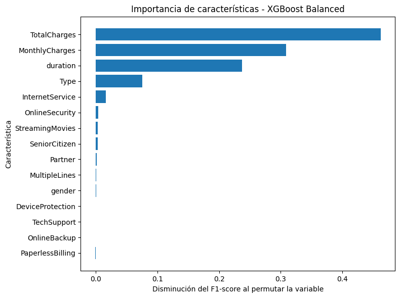

# 📱 Customer Churn Prediction — Telecom

Supervised machine learning model to predict customer churn risk for a telecom company, enabling the retention team to proactively identify and act on at-risk customers.

---

## 🎯 Business Objective

Identify customers likely to cancel their service contract in the next 90 days, reducing revenue loss through targeted retention actions.

> A model that predicts churn correctly 8 out of 10 times allows the retention team to focus resources on customers who actually need intervention.

---

## 📊 Model Results

| Model | Accuracy | Recall | F1-Score | ROC-AUC |
|---|---|---|---|---|
| RF Original | 0.856 | 0.608 | 0.683 | 0.893 |
| RF Balanced | 0.860 | 0.600 | 0.687 | 0.894 |
| RF GridSearch | 0.863 | 0.625 | 0.700 | 0.897 |
| XGBoost | 0.853 | 0.556 | 0.659 | 0.897 |
| **XGBoost Balanced** | **0.874** | **0.836** | **0.772** | **0.938** |

> **XGBoost Balanced** is the winning model with **ROC-AUC of 93.8%** and **Recall of 83.6%** — correctly identifying 8 out of 10 customers at risk of churning.

---

## 🔍 Key Business Findings



1. **TotalCharges is the strongest churn predictor** — customers who cancel have paid significantly more over their lifetime, suggesting price sensitivity is the primary driver
2. **Contract type drives behavior** — month-to-month customers churn at much higher rates than annual contract customers; incentivizing longer contracts is the most actionable retention lever
3. **Tenure is critical** — the first months of the customer relationship are the highest-risk window; early engagement programs can reduce early churn
4. **Demographics don't predict churn** — gender and senior citizen status showed near-zero predictive value; retention resources should focus on contract and pricing strategy

---

## 🚨 Retention Recommendations

Based on model output, high-risk customers share these characteristics:
- Month-to-month contract
- High MonthlyCharges (> $70/month)
- Tenure < 6 months
- No OnlineSecurity or TechSupport services

**Suggested actions:**
- Proactive outreach to the 1,609 customers identified above the optimal threshold (0.6895)
- Offer contract upgrade incentives to month-to-month customers with high charges
- Bundle OnlineSecurity/TechSupport for new customers in the first 3 months

---

## 🛠️ Technical Stack

- **Python** — pandas, numpy, matplotlib, seaborn
- **Machine Learning** — scikit-learn, XGBoost
- **Techniques** — Label Encoding, StandardScaler, class_weight balancing, threshold optimization
- **Metrics** — ROC-AUC, Recall, F1-Score, Precision

---

## 📁 Project Structure

```
churn-prediction-telecom/
├── Customer churn prediction.ipynb   # Full notebook: EDA, modeling, evaluation
└── README.md
```

---

## 📂 Dataset

4 CSV source files merged by customer ID: contract, internet, personal, phone data.  
~7,000 customer records | 26% churn rate | Snapshot date: Feb 1, 2020

---

## 👤 Author

**David Encinas Basurto, PhD**  
[LinkedIn](https://linkedin.com/in/david-encinas) · [GitHub](https://github.com/DavidEncinas)

---

*Project developed as part of the Data Science Diploma — TripleTen*

